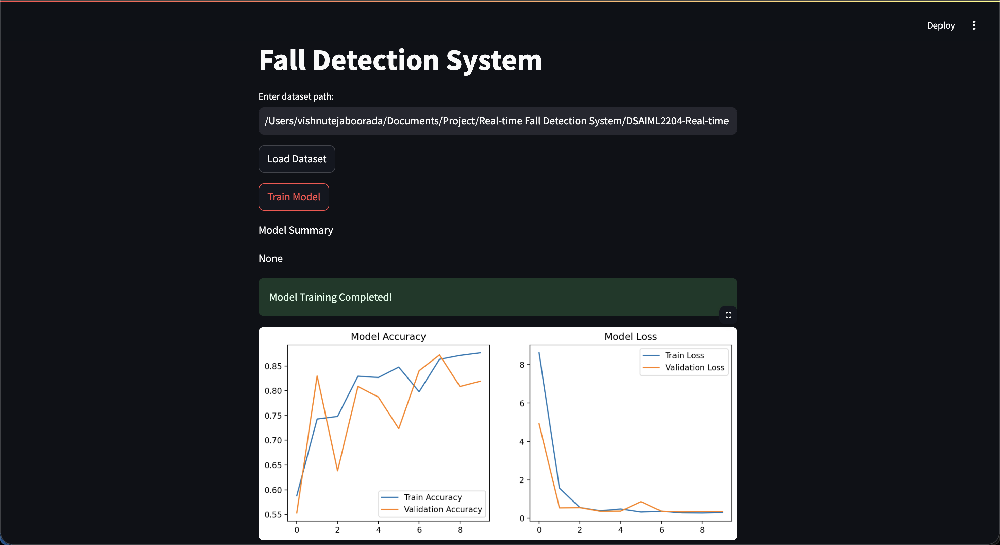
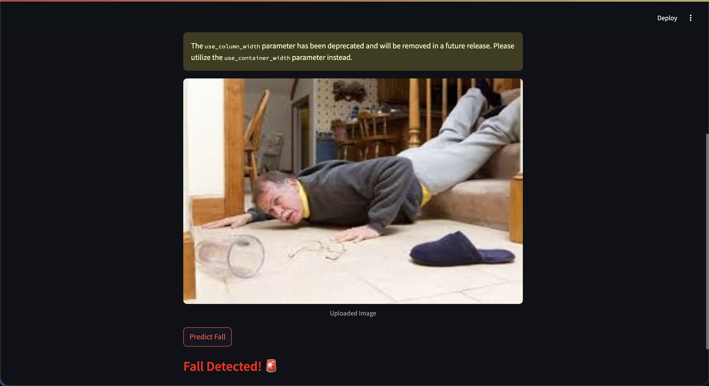

# 🧑‍🦽 Fall Detection System using Deep Learning

This project implements a **real-time fall detection system** using **TensorFlow (Keras), MobileNetV2, and Streamlit**. The app allows you to **train a model on a custom dataset**, visualize training performance, and run **real-time predictions** on uploaded images to detect falls.  

---

## ✨ Features
- 📂 **Dataset Loader**: Upload and preprocess datasets from a directory structure.  
- 🔗 **Transfer Learning**: Uses **MobileNetV2** pretrained on ImageNet for feature extraction.  
- 🏋️ **Training Pipeline**:  
  - 🔄 Data augmentation (rotation, zoom, flip, etc.)  
  - ✂️ Train/validation split  
  - 📊 Accuracy and loss plots after training  
- 🖥️ **Interactive Streamlit App**:  
  - 📤 Upload an image and predict fall / no-fall in real time.  
- ✅ **Binary Classification Output**:  
  - ✅ No Fall Detected  
  - 🚨 Fall Detected  

---

## ⚙️ Setup Instructions

### 🛠️ Create a Virtual Environment
```bash
python -m venv venv
source venv/bin/activate   # On Linux/Mac
venv\Scripts\activate      # On Windows
```

📦 Install Dependencies
```bash
pip install -r requirements.txt
```

▶️ Run the App
```bash
streamlit run app.py
```

📊 Training & Prediction Flow

1. 📂 Enter dataset path in the Streamlit app.
2. ⬇️ Click "Load Dataset" to preprocess and split into training/validation.
3. 🏋️ Click "Train Model" to start training.
4. 📈 View Accuracy & Loss plots after training.
5. 🖼️ Upload a test image (.jpg, .png, .jpeg).
6. 🤖 Click "Predict Fall" to classify the image.




